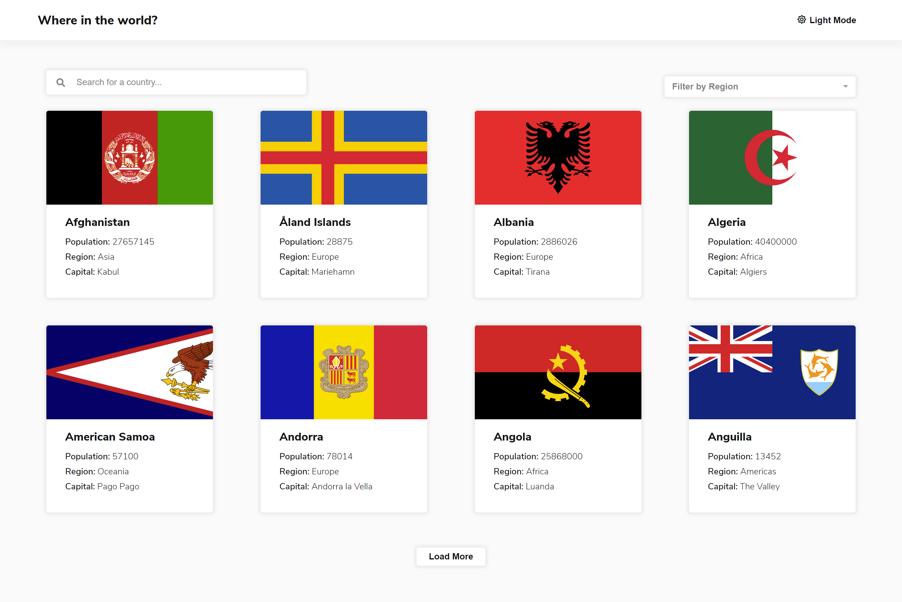
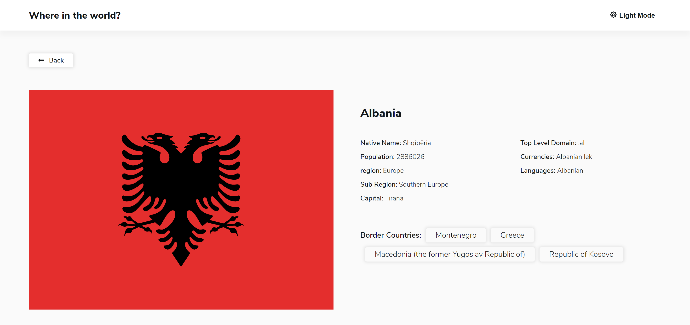

# Zyda Frontend Test - REST Countries API with color theme switcher

This is a solution to the [REST Countries API with color theme switcher task](https://github.com/zydalabs/FrontEnd-Test). Zyda Frontend Task helps us test your coding skills by building a realistic project.

## Table of contents

- [Overview](#overview)
  - [The task](#the-task)
  - [Screenshot](#screenshot)
  - [Links](#links)
- [My process](#my-process)
  - [Built with](#built-with)
  - [Continued development](#continued-development)
  - [Useful resources](#useful-resources)
- [Author](#author)

## Overview

This web site integrates with [REST Countries API](https://restcountries.eu) to view all countries details.

### The task

Users should be able to:

- See all countries from the API on the homepage
- Search for a country using an `input` field
- Filter countries by region
- Click on a country to see more detailed information on a separate page
- Click back button to return to countries page from the details page
- Toggle the color scheme between light and dark mode

### Screenshot

- Listing page :

- Details page :

### Links

- Solution URL: [solution URL](https://github.com/MarinaAlber/MarinaAlber.github.io/tree/master/countries-app)
- Live Site URL: [live site URL](https://marinaalber.github.io/)

## My process

### Built with

- Semantic HTML5 markup
- SASS
- [React](https://reactjs.org/) - JS library

### Continued development

- Code enhancements

### Useful resources

- [REST Countries](https://restcountries.eu/) - This helped me to learn about the API Endpoints and how to use it.

- [GIT Hub Pages](https://docs.github.com/en/pages/getting-started-with-github-pages/creating-a-github-pages-site)- - This helped me to learn how to host my application using git hub pages

## Author

- Marina Alber
